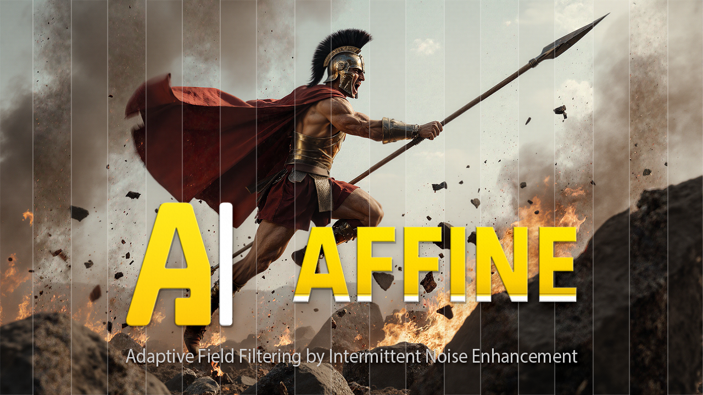

# AFFINE
## Adaptive Field Filtering by Intermittent Noise Enhancement

**AFFINE** is a comprehensive ComfyUI node suite that performs sparse **Adaptive Field Filtering by Intermittent Noise Enhancement** in latent space to steer diffusion results during sampling.  
It works by applying controlled scale and bias (`z' = scale * z + bias`) to masked regions of the latent tensor, enabling precise control over brightness, contrast, and detail enhancement without collapsing noise structure.

The suite includes:
- **Core Affine Nodes** - Basic latent space transformations
- **Integrated Samplers** - KSampler and Custom Sampling with built-in affine scheduling
- **Ultimate SD Upscaler Ports** - Tiled upscaling with affine enhancement
- **Pattern Noise Generation** - AFFINE augmented random noise for custom sampling
- **Modular Options System** - Granular control over all parameters (also a super options node for the adventurous)

### Examples

#### [▶︎] WAN Example
[](https://www.youtube.com/watch?v=2IgdGCjVCcg)

#### [▶︎] 720p -> 2k Example
[](https://www.youtube.com/watch?v=94GXp6fV9QI)

**Things to take note of:**
- The background rock quality is improved.
- The trees and brush look more naturally dispersed.
- Roads are more realistic
- The foreground detail is *essentially* better preserved.
- The overall contrast is reduced.

---

## 🧠 How it works (ELI5)

- **Controlled enhancement**: Apply scale and bias transforms to specific regions defined by procedural masks.
- **Pattern-based masking**: Choose from 20+ patterns including Perlin noise, spectral noise types, geometric patterns, and content-aware masks.
- **Temporal consistency**: Static or per-frame mask generation for stable video processing.
- **External gating**: Use custom mask images to limit where effects are applied.
- **Modular configuration**: Mix and match common options with pattern-specific parameters.
- **Integrated workflows**: Built-in samplers handle scheduling automatically, or use manual latent transforms between sampling passes.

The core transformation: `z' = scale * z + bias` where the mask determines the blend between original and transformed values.

---

## ✨ Why AFFINE?

- **Improves Quality** – Enhance detail in light LoRA outputs or tame overly contrasted/burned results from speed-boosting LoRAs.
- **Works in latent space** – Avoids costly VAE decode/encode cycles and raster-space artifacts.  
- **Sparse control** – Apply adjustments selectively using sophisticated mask patterns.  
- **Stable video** – Temporal modes maintain consistency or controlled variation across frames.  
- **Flexible integration** – Use standalone transforms, integrated samplers, or tiled upscaling workflows.
- **Advanced patterns** – 20+ mask types from simple geometric to complex spectral and content-aware patterns.
- **Ultimate SD Upscaler compatibility** – Tiled processing with world-aligned noise and affine enhancement.

---

## 🔧 Workflow Options

### Option 1: Manual Latent Transform (Classic)
1. Run **KSampler Advanced** or **Custom Sampling** for high-noise steps
2. Apply **Latent Affine** or **Latent Affine Simple** 
3. Resume with second sampler for low-noise steps

### Option 2: Integrated Samplers
- Use **KSampler Affine** or **KSampler Affine Advanced** for automatic scheduling
- Use **Custom Sampler Affine Advanced** for custom sampling workflows
- Configure affine schedule, interval, and pattern parameters directly

### Option 3: Tiled Upscaling
- Use **Ultimate Affine KSampler - USDU** nodes for large image processing
- Combines upscaling, tiling, and affine enhancement in one step
- Supports custom samplers and sigma schedules
- 
---

## 📋 Node Reference

### Core Affine Nodes

#### Latent Affine
The main affine transformation node with full configurability.

**Inputs:**
- `latent` – Input latent tensor
- `scale` – Multiplicative factor (1.0 = no change, <1 darkens, >1 brightens)
- `bias` – Additive offset (-2.0 to 2.0)
- `pattern` – Mask pattern (20+ options including procedural, spectral, and content-aware)
- `temporal_mode` – `static` or `per_frame` for video
- `seed` – Random seed for procedural patterns
- `external_mask` – Optional IMAGE input for custom masking
- `options` – Base options DICT (use WASLatentAffineCommonOptions)
- `noise_options` – Pattern-specific options DICT

**Returns:**
- `latent` – Transformed latent
- `mask` – Generated mask for visualization

#### Latent Affine Simple
Streamlined version with auto-tuned parameters for quick results.

**Inputs:**
- `latent` – Input latent
- `scale` – Multiplicative gain (0.95-0.98 for subtle darkening)
- `noise_pattern` – Auto-tuned mask pattern
- `seed` – Random seed
- `temporal_mode` – `static` or `per_frame`
- `frame_seed_stride` – Seed increment per frame

**Returns:**
- `latent` – Adjusted latent
- `mask` – Generated mask

### Integrated Samplers

#### KSampler Affine / KSampler Affine Advanced
Drop-in replacements for standard KSamplers with built-in affine scheduling.

**Key Parameters:**
- `affine_interval` – Apply affine every N steps
- `max_scale` / `max_bias` – Peak transformation values
- `affine_schedule` – WASAffineScheduleOptions DICT for timing curve
- `affine_seed` / `affine_seed_increment` – Seed management
- All standard KSampler parameters

#### Custom Sampler Affine Advanced
Advanced custom sampling with affine integration.

**Inputs:**
- `noise` / `guider` / `sampler` / `sigmas` – Standard custom sampling inputs
- `latent_image` – Input latent
- Affine parameters (same as KSampler variants)

**Returns:**
- `output` – Final latent
- `denoised_output` – Denoised latent

### Ultimate SD Upscaler Ports

#### Ultimate Affine KSampler - USDU
Full upscaling with model-based upscaling and affine enhancement.

**Key Features:**
- `upscale_model` / `upscale_factor` – Pre-upscale configuration before tiling.
- Tiling parameters – `tile_width`, `tile_height`, `tile_padding`, `mask_blur`.
- `tiled_decode` – Uses ComfyUI's built-in VAE tiled decode (compression-aware) to reduce VRAM peaks for large images/videos.
- Batching controls – `batch_size` for processing the IMAGE batch in chunks; `merge_frames_in_batch` to merge [B,F,H,W,C] decodes into [B*F,H,W,C] for safe concatenation.
- Noise determinism – `deterministic_noise` and `global_noise_mode` to make outputs batching-invariant and ignore NOISE input if desired.
- Cross-batch blending – `overlap_blend_count` and `overlap_blend_curve` to softly crossfade at batch boundaries without dropping frames.
- Full affine parameter set – `affine_interval`, `max_scale`, `max_bias`, `pattern`, `affine_seed`, `affine_seed_increment`, `affine_schedule`, and optional `external_mask` gating with `options`/`noise_options`.

#### Ultimate Affine KSampler (No Upscale) - USDU
Tiled processing without pre-upscaling.

#### Ultimate Affine KSampler (Custom) - USDU
Supports custom samplers and sigma schedules via `custom_sampler` and `custom_sigmas` while keeping the same tiling/affine controls.

#### Advanced: Tiled Decode Parameters
When `tiled_decode` is enabled, you can fine-tune the VAE tiled decode behavior:

- `tiled_tile_size` – Target output tile size (in pixels, pre-compression). Larger is fewer tiles (faster) but higher VRAM peaks.
- `tiled_overlap` – Output-space overlap (in pixels, pre-compression). Higher overlap improves tile blending but increases work.
- `tiled_temporal_size` – Temporal window for video decode (frames, pre-compression). 0 disables temporal tiling.
- `tiled_temporal_overlap` – Temporal overlap in frames (pre-compression). Helps blend across temporal windows.

Notes:
- Parameters are adjusted automatically using the VAE’s spatial/temporal compression so the decode receives latent-space `tile_x`, `tile_y`, and `overlap`.
- Sanity checks ensure `overlap <= tile_size/4` and `temporal_overlap <= temporal_size/2`.

#### Batch Join Smoothing and Determinism

- `merge_frames_in_batch` – ComfyUI IMAGE tensors are 4D `[B,H,W,C]` by convention. This option only applies when a decoder returns a temporal IMAGE tensor `[B,F,H,W,C]` (e.g., some tiled temporal VAE decodes). In that case, frames are flattened to `[B*F,H,W,C]` so batches with different frame counts can be concatenated safely. Has no effect for standard 4D images.
- `overlap_blend_count` / `overlap_blend_curve` – Crossfade the last K images of a batch into the first K of the next batch at concatenation time (no frame drops). Curves: `cosine` (smooth) or `linear`.
- `deterministic_noise` – Generate local noise with per-item seeds to make results independent of batch size.
- `global_noise_mode` – Force deterministic noise for the entire run (ignores NOISE input) for strict batching invariance.

### Pattern Noise Generation

#### Affine Pattern Noise
Generates structured noise by augmenting base ComfyUI noise with procedural patterns.

**Inputs:**
- `pattern` – Noise pattern type
- `seed` – Random seed
- `affine_scale` – Pattern amplitude multiplier
- `normalize` – Center and scale pattern
- `affine_bias` – Additive bias
- `options` / `noise_options` – Pattern parameters

**Returns:**
- `noise` – Structured noise generator

---

## 🎨 Available Patterns

### Spectral Noise Types
- **white_noise** – Uniform frequency spectrum
- **pink_noise** – 1/f frequency falloff (natural)
- **brown_noise** / **red_noise** – 1/f² falloff (warmer)
- **blue_noise** – High-frequency emphasis
- **violet_noise** / **purple_noise** – f² emphasis (harsh)
- **green_noise** – Mid-frequency band-pass
- **black_noise** – Sparse narrowband spectrum

### Geometric Patterns
- **checker** – Checkerboard tiles
- **bayer** – Ordered dithering matrix
- **solid** – Constant alpha mask

### Procedural Patterns
- **perlin** – Smooth fractal noise (organic)
- **worley_edges** – Cellular noise emphasizing edges
- **poisson_blue_mask** – Blue-noise Poisson-disk distance field
- **cross_hatch** – Oriented gratings and cross-hatch
- **tile_oriented_lines** – Per-tile oriented lines
- **dot_screen_jitter** – Halftone dots with jitter
- **velvet_noise** – Sparse high-frequency impulses

### Frequency Domain
- **ring_noise** – Narrow annulus in frequency domain
- **highpass_white** – High-pass filtered white noise

### Content-Aware (from latent)
- **detail_region** – High texture/variance areas
- **smooth_region** – Low detail areas
- **edges_sobel** – Sobel edge detection
- **edges_laplacian** – Laplacian edge detection

### External
- **external_mask** – Use provided IMAGE directly

---

## 🔧 Options System

### Common Options (WASLatentAffineCommonOptions)
Base parameters that apply to all patterns:

- **mask_strength** – Scales mask intensity (0.0-2.0)
- **threshold** – Binarize mask if > 0 (0.0-1.0)
- **invert_mask** – Invert after threshold/blur
- **blur_ksize** / **blur_sigma** – Gaussian blur for soft edges
- **clamp** / **clamp_min** / **clamp_max** – Output value clamping
- **frame_seed_stride** – Seed increment per frame (temporal mode)
- **compute_device** – Where to generate masks (auto/cuda/cpu)
- **sharpen_enable** / **sharpen_sigma** / **sharpen_amount** – Unsharp masking

### Pattern-Specific Options
Each pattern type has dedicated option nodes:

#### WASPerlinOptions
- `perlin_scale` – Base feature size (larger = smoother)
- `perlin_octaves` – Number of octaves (1-8)
- `perlin_persistence` – Amplitude falloff per octave
- `perlin_lacunarity` – Frequency multiplier per octave

#### WASWorleyEdgesOptions  
- `worley_points_per_kpx` – Cell density per 1000 pixels
- `worley_metric` – Distance metric (L2/L1)
- `worley_edge_sharpness` – Edge emphasis exponent

#### WASPoissonBlueOptions
- `poisson_radius_px` – Minimum dot spacing
- `poisson_softness` – Distance field smoothing

#### WASCrossHatchOptions
- `hatch_freq_cyc_px` – Line frequency
- `hatch_angle1_deg` / `hatch_angle2_deg` – Hatch angles
- `hatch_square` – Square wave vs sine
- `hatch_phase_jitter` – Random phase variation
- `hatch_supersample` – Anti-aliasing factor

#### WASRingNoiseOptions
- `ring_center_frac` – Ring center (fraction of Nyquist)
- `ring_bandwidth_frac` – Ring thickness

#### WASHighpassWhiteOptions
- `highpass_cutoff_frac` – Butterworth cutoff
- `highpass_order` – Filter steepness

#### WASTileLinesOptions
- `tile_line_tile_size` – Tile dimensions
- `tile_line_freq_cyc_px` – Line frequency per tile
- `tile_line_jitter` – Orientation randomness

#### WASDotScreenOptions
- `dot_cell_size` – Halftone cell size
- `dot_jitter_px` – Dot center randomness
- `dot_fill_ratio` – Coverage per cell

#### WASGreenNoiseOptions / WASBlackNoiseOptions / WASVelvetOptions
- Spectral and impulse noise parameters
- See node tooltips for detailed ranges

#### WASCheckerOptions / WASBayerOptions
- `checker_size` / `bayer_size` – Pattern scale

#### WASDetailRegionOptions / WASSmoothRegionOptions
- `content_window` – Kernel size for content analysis

### Affine Schedule Options (WASAffineScheduleOptions)
Controls timing and intensity curves for integrated samplers:

- **start** / **end** – Active range (0.0-1.0 of total steps)
- **bias** – Curve bias toward start/end
- **exponent** – Power curve shaping
- **curve** – Easing function (linear, sine, cubic, etc.)
- **start_offset** / **end_offset** – Value adjustments

**Returns:** Schedule DICT + visualization plot

---

## 🏞️ External Mask Gating

Use external masks to limit where affine effects are applied:

- Connect a grayscale IMAGE to `external_mask` input
- Set `pattern` to any procedural pattern (not `external_mask`)
- The generated pattern mask is multiplied by your external mask
- Affine transforms only apply where both masks are bright

**Use Cases:**
- Apply effects only to specific objects or regions
- Combine with segmentation masks for targeted enhancement
- Create complex composite effects with multiple mask layers


---

## 📂 Installation

### Manual
1. Clone the repository to your `ComfyUI/custom_nodes` directory:
   ```bash
   cd ComfyUI/custom_nodes
   git clone https://github.com/WASasquatch/was_affine.git
   ```
2. Restart ComfyUI via [Manager](https://github.com/Comfy-Org/ComfyUI-Manager) or console

### Manager
1. Open [Manager](https://github.com/Comfy-Org/ComfyUI-Manager) and click "Install Custom Nodes"
2. Search "**WAS Affine**" and click install on the custom node by author WAS.
3. Restart ComfyUI via Manager's main menu.


**Dependencies:** Standard ComfyUI installation (torch, numpy).
**Note:** Doesn't requires UltimateSDUpscale nodes.

---

## 🧪 Tips & Best Practices

### General Guidelines
- **Start subtle**: Latent space is sensitive - `scale=0.95` can be quite strong
- **Model sensitivity varies**: Some models respond more dramatically than others
- **Flux/Krea models**: May need positive scale values (inverted behavior)
- **Lightning LoRAs**: Combine with lower CFG (1-2) for best results

### Pattern Selection
- **Organic content**: perlin, worley_edges work naturally
- **Architectural/geometric**: checker, bayer, cross_hatch
- **Fine detail work**: velvet_noise, highpass_white, ring_noise
- **Content-aware**: detail_region for textures, smooth_region for skies

---

## 📜 License

[MIT](LICENSE) – Free to use, modify, and share with attribution.

---

## 🙏 Acknowledgments

- ComfyUI team for the excellent software
- Ultimate SD Upscaler and ComfyUI wrapper developers
- Community feedback and testing contributions like "Ansel" and "Lucifer". 
